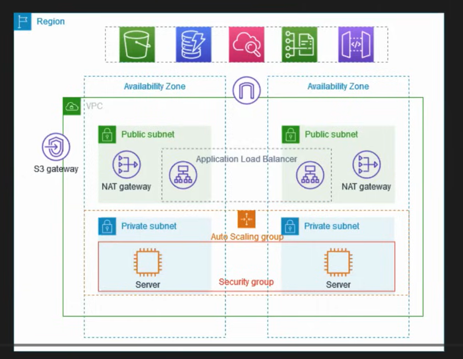

# 🚀 AWS VPC Infrastructure Deployment

## 🌐 Overview
This project demonstrates the **deployment of a robust AWS Virtual Private Cloud (VPC)** infrastructure designed for production environments.  
The configuration ensures **high availability, scalability, and enhanced security** by leveraging multiple AWS services and architectural best practices.

---

## 🧩 Key Implementations

- 🌍 **Public & Private Subnets** – Structured architecture with segregated tiers for security and performance  
- 🏗️ **Multi-AZ Deployment** – Enhanced fault tolerance and redundancy  
- ⚖️ **Application Load Balancer (ALB)** – Efficiently distributes traffic across instances  
- 🌐 **NAT Gateways** – Enable secure outbound internet access for private resources  
- 📈 **Auto Scaling Groups** – Automatically handle traffic fluctuations and maintain elasticity  
- 🔐 **Security Groups & Route Tables** – Granular control of inbound/outbound traffic  
- 🧭 **Internet Gateway** – Managed access for public-facing components  
- 🧱 **Private EC2 Isolation** – Ensured no direct public exposure to sensitive instances  

---

## 💡 Insights & Learnings

Through this deployment, I gained practical experience with:
- Designing **subnets for workload isolation and network segmentation**  
- Configuring **secure routing and traffic flow management**  
- Implementing **high-availability** setups across multiple AZs  
- Managing **auto-scaling and elasticity** for compute resources  
- Strengthening **access control** using Security Groups and NAT Gateways  
- Applying **AWS networking best practices** for security and cost optimization  

---

## 🧰 Technologies Used
- **AWS Services**: VPC, EC2, ALB, NAT Gateway, Auto Scaling, IAM, CloudWatch  
- **Tools**: Terraform (optional), AWS CLI, CloudFormation  
- **Networking Concepts**: CIDR, Subnetting, Route Tables, Gateways, Security Groups  

---

## 📸 Architecture Diagram
> Below is the architecture I implemented:

---

## 📚 References
- [AWS VPC Documentation](https://docs.aws.amazon.com/vpc/latest/userguide/what-is-amazon-vpc.html)  
- [AWS Architecture Best Practices](https://aws.amazon.com/architecture/)

---

## 🏷️ Tags
`#AWS` `#VPC` `#Networking` `#CloudComputing` `#DevOps` `#InfrastructureAsCode` `#HandsOnLearning`

---

⭐ **If you liked this project, consider giving it a star!** 🌟  
👩‍💻 *Author: [Chandana Krishna](https://github.com/ChandanaKrishna27)*
